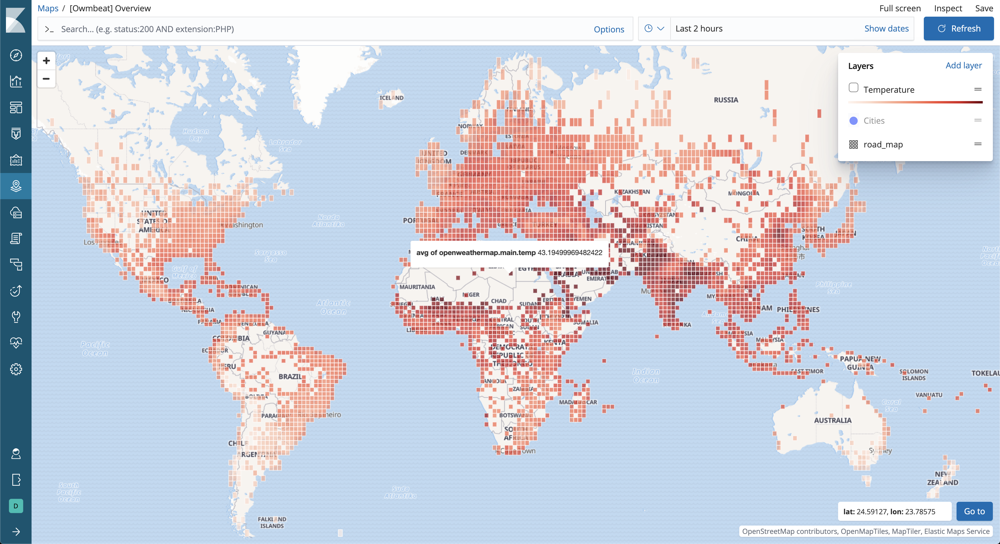

# Open Weather Map Beat (owmbeat)

Welcome to Owmbeat.

Owmbeat implements one (start simple) api call from [OpenWeatherMap](https://openweathermap.org/) service.

You can configure [Cities within a rectangle zone](https://openweathermap.org/current#rectangle)

Example API call might look like following
```
http://api.openweathermap.org/data/2.5/box/city?bbox=12,32,15,37,10
```


## Installation
Download and install appropriate package for your system. Check release [page](https://github.com/radoondas/owmbeat/releases) for latest packages.

You also can use Docker image `docker pull radoondas/owmbeat`


## Configuration

To run owmbeat you need to [register](https://home.openweathermap.org/) and [generate](https://home.openweathermap.org/api_keys) your `appid` to authenticate your API requests.

```yaml
  appid: "yourappid"

``` 

Period definition defines how often to pull data from service. This time period depends on your level of subscription.
For free API id does not make sense to pull new documents less than 1h. Set period to `1h`.
```yaml
  period: 1h
```

Define the rate limit for your account type. The default is set to 60 for free account type.
```yaml
  maxApiCalls: 60
```

Next, define your regions. Each region is one `bbox` definition from api call. YOu can define multiple regions to cover different areas.

```yaml
  regions:
    - region:
      enabled: true
      name: "Slovakia"
      description: "Somewhere in Europe"
      lon-left: 17
      lat-bottom: 46
      lon-right: 22
      lat-top: 51
      zoom: 10
```


## Run

```
./owmbeat -c owmbeat.yml -e 
```

## Visualisations
This is an example of temperature visualisation using [Map](https://www.elastic.co/guide/en/kibana/current/maps.html) application in Kibana.




## Build
If you want to build Owmbeat from scratch, follow [build](BUILD.md) documentation.
